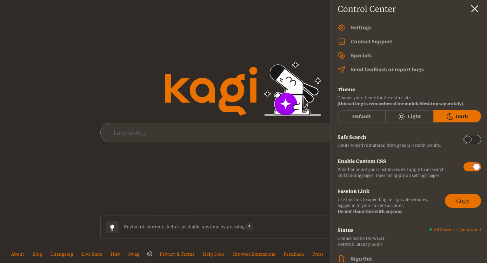
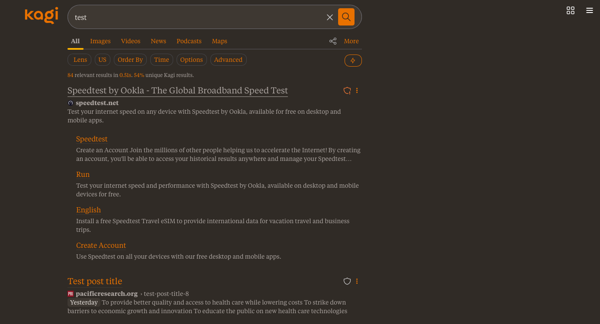
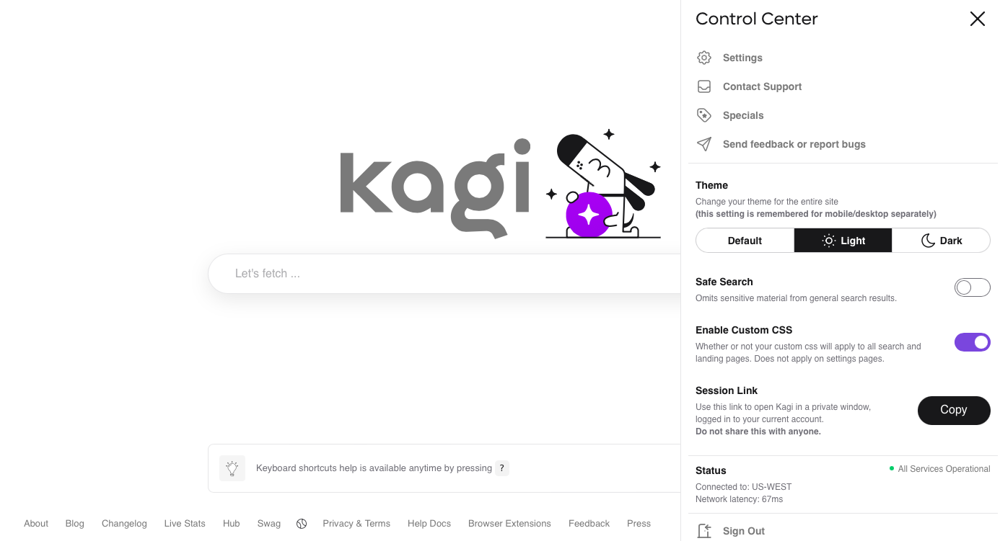
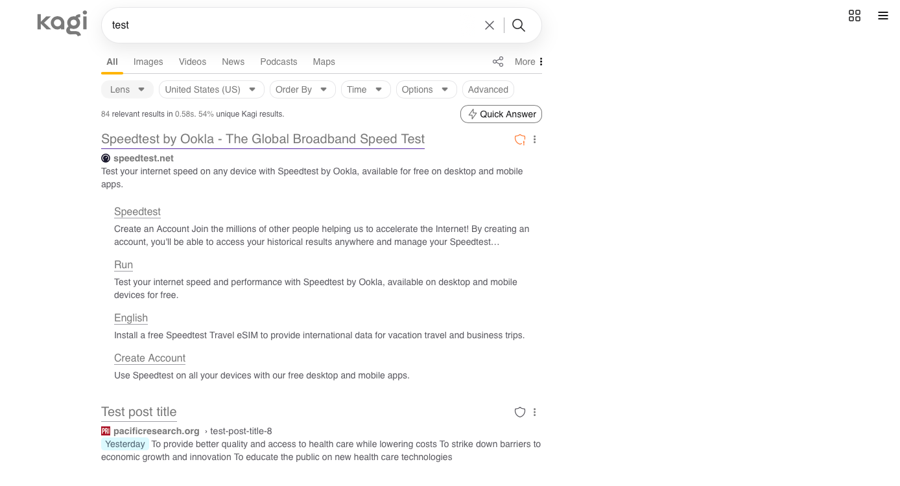

# Kagi Claude Theme

A warm, cozy custom CSS theme for [Kagi Search](https://kagi.com) inspired by Claude Desktop's aesthetic. Features a rich brown dark mode with orange accents and a soft monochromatic light mode.

## Screenshots

### Dark Mode
#### Home


#### Results


### Light Mode
#### Home


#### Results


## Features

- **Dark mode**: Warm brown tones (`#2F2B26`) with vibrant orange accents (`#D97706`)
- **Light mode**: Soft monochromatic grays for a gentle, low-contrast experience based on [Cidian – Mandarin Dictionary's](https://cidian.co) Light theme
- **Default mode**: Untouched — Kagi's native theme
- Clean, minimal UI adjustments for Dark Mode:
  - Hidden search bar separator, icon-only quick answer button
  - Region filter abbreviation (shows "US" instead of "United States (US)")
  - Styled domain info modal with improved positioning
  - Consistent accent colors across buttons, toggles, links, and dropdowns

## Installation

1. Go to [Kagi Custom CSS Settings](https://kagi.com/settings?p=custom_css)
2. Enable the **Custom CSS** toggle
3. Copy the contents of [`theme.css`](theme.css) and paste it into the text field
4. Click **Apply Custom CSS**
5. Select your preferred theme:
   - **Default**: Kagi's native light theme (no custom styling)
   - **Light**: Soft gray accents
   - **Dark**: Warm brown + orange theme

## Recommended Settings

For best results with the dark theme:
- Set Kagi's base theme to **Dark** or **Moon Dark**

## Color Palette

### Dark Mode
| Role | Hex |
|------|-----|
| Background | `#2F2B26` 🟤 |
| Background Dark | `#292521` |
| Background Light | `#3D3832` |
| Text | `#E8E4DF` |
| Text Muted | `#A8A29E` |
| Accent | `#D97706` 🟠 |

### Light Mode
| Role | Hex |
|------|-----|
| Accent | `#7A7A7A` |

## Customization

To customize the colors, edit the CSS variables at the top of the dark theme section:

```css
.theme_moon_dark,
.theme_dark {
  --custom-bg: #2F2B26;
  --custom-bg-dark: #292521;
  --custom-bg-light: #3D3832;
  --custom-text: #E8E4DF;
  --custom-text-muted: #A8A29E;
  --custom-accent: #D97706;
  /* ... */
}
```

## Credits

Designed by **sa**–紗 ([@usants](https://github.com/usants)) and **Anthropic Claude Opus 4.5**

## License

MIT License — feel free to fork, modify, and share!

## Contributing

Issues and pull requests welcome!
